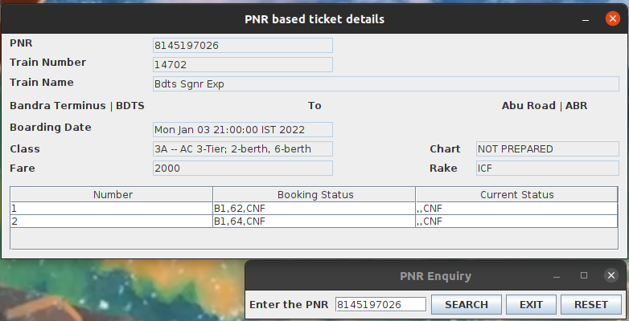

# PNR_Enquiry_IndianRailways_v2.0

This project caters to the extraction of the status of PNR number (Passenger Name Record) of Indian Railways. PNR number is unique to each and every ticket bought in the railways. With the help of it,
we can get the exact details of the ticket in hand.

This is a program with a simple GUI, which asks for the 10 digit PNR number which is issued when a railway ticket is booked in India. Then, after processing the request, another window opens up which
contains the details of the PNR request namely - PNR number, Train Number, Train Name, Boarding station, Destination station, Boarding Date, Class of Travel, Chart status, Booking status and current
status of the passengers on the ticket.

## Versions:

| Serial | Version | Time | Artifact | Significant changes | 
| ------ | ------- | ---- | -------- | ------------------- |
| 2      | 2.1     | 2021-12-09   | 2.1-SNAPSHOT | Adding Fare and Rake Type |
| 1      | 2.0     | 2021-12-04   | 2.0-SNAPSHOT | Overhaul to new standards and new enquiry mechanism |

## Showcase:

Screenshots are in the 'showcase' folder.

## TODO:

1. Update PnrResult class constructor to add Ticket and list of passengers.
2. Overhaul tests and increase functional checks as well.